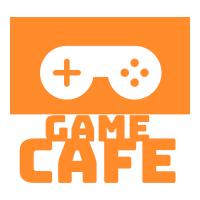

# QUIZ CHAT APP

The Game Cafe was designed to allow users to enjoy multiple game experiencs and come together in a ChatRoom environment where they can kick back and relax!

 

# Usage 
Users are brought to the main page where they will create their credentials. After logging in the user will be brought to a page filled with dynamically created room's by other users or can even create a room of there own! When the user feels they no longer wish to chat and want to play a couple games they can easily acess our list of games from the dropdown menu. Once clicked the user is seemlesly brought through multiple game pages where they can play to their hearts content.  

# Technologies Implemented 
1. Javascript
2. css
3. scss
4. Bootstrap
5. React.js
6. MongoDB
7. FireBase
8. Boots

## Acknowledgements

https://github.com/FakeMetalFan - Implementation for our minesweeper game!

https://github.com/raravi - Implementation for our Sudoku!

https://github.com/completejavascript/ - Implementation for our tic-tac-toe

<h2>Thank you so much!</h2>

# Team
## Frank Buono - https://github.com/fbuonojr, 
## Chris Faux - https://github.com/chrisfaux95, 
## Robert Kaylor - https://github.com/Rkaylor, 
## Oscar Chiriboga - https://github.com/cracso

### Technologies Used (so far): Firebase, Mongoose, React.js